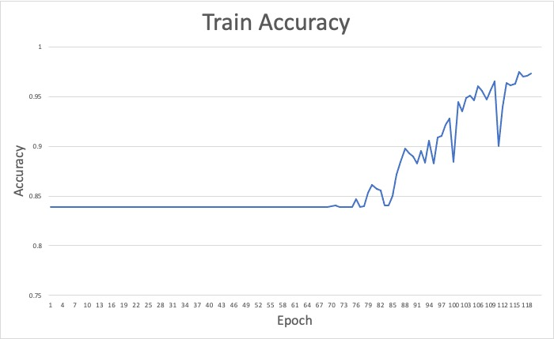

# Vehicle,  vehicle speed and road lane detection using CNN for automated vehicles

### Members: Yujian Mo, Lifei Zhu, Lin Lyu, Yuchen Lu

### Abstract
The autonomous vehicle is a hot topic these days, while vehicle detection, speed detection and lane detection are important aspects of this field of study which may be necessary references for the development of autonomous vehicles. In this project, we plan to do object detection in pictures not only for vehicles but also for other objects showing up in the pictures, such as roadway lanes, bicycles, people, etc. Then we will do speed calculation for vehicles through some continuous videos. By doing this, we can help to provide valuable information to the autonomous driving system. On the basis of reading a lot of literature about object detections and ways to calculate vehicle speed, now we tried two different baseline models, Resnet 50 and Vgg 16 though some experiments using a small dataset of car pictures to find suitable models and evaluation methods according to val accuracy and val average loss. For future work we plan to implement Faster R-CNN on top of the 50-layer and 152-layer variants of residual networks and evaluate it through mean Average Precision, and we expect we would get an improved object detection performance when implementing Faster R-CNN based on residual networks compared to our baseline models. 

### Description of working baseline		
#### Baseline 1 : VGG16
We chose VGG16 as our first baseline model, because it significantly outperformed older network architectures in image recognition, showing that thinner (smaller filters in each layer), deeper networks learn better features than wider, shallower ones. The key innovation of VGG style networks [22] was that using small 3x3 filters in convolutional layers allows for networks with greater depth without an explosion in the number of trainable parameters. 

The downside of deeper networks is that they are harder to train with today’s optimization algorithms [23]. Experiments have shown that arbitrarily adding more layers to a network past a certain depth increases training error, despite the deeper network being a superset of the shallower network. The deeper network could in theory replicate the shallower network by learning the same weights for the shallow network’s layers and learning to use each extra layer as an identity mapping. The deepest VGG style network that could be trained effectively was VGG19, with 19 layers. Sp we expect that VGG19 would have a better performance than our current baseline model, VGG16.

#### Baseline 2: Residual Networks 		

Residual networks address deep networks’ trouble learning identity mappings by adding shortcut connections between the output of one layer and the input of another layer not directly connected to it. The input to the higher layer becomes the sum of the outputs of the layer directly below it and another layer multiple layers below that.  	

To reduce the number of training parameters and thus decrease training time, residual networks also introduce a bottleneck architecture for layer blocks. Where a VGG network uses consecutive identical convolutional layers with 3x3 filters in a block, residual networks use a 1x1 layer followed by a 3x3 layer followed by another 1x1 layer. Shortcuts only connect 1x1 layers of the same dimensions so that they can be used as identity mappings instead of requiring the network to learn weights to map an output to an input of different dimensions. This allows shortcut connections to be used without additional training parameters.	

Finally, residual networks use batch normalization, which speeds up the training of deep networks by normalizing the distribution of individual layers’ inputs. Batch normalization had not been discovered at the time of VGG16’s development. The combination of these techniques allow for effective training of residual networks hundreds of layers deep, achieving superior image recognition performance to VGG networks on Imagenet. Given the superior performance of residual networks in image recognition, they must be learning better, higher level features in the convolutional layers.

To summarize, in this project, we implemented VGG16 and ResNet50 for car detection for now, and we will complete the baseline model of road lane and vehicle speed detection in the future and evaluate their performance through standard evaluation metric for objection detection, the mean Average Precision (mAP). And for more information about code, our baseline model architecture, hyper-parameters, and baseline model result, please see GitHub.

### Baseline Model Architecture 

### Intermediate conclusion

